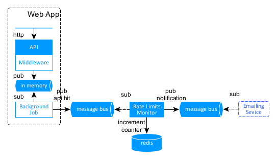

# Example of using Redis as both pub-sub and a database for rate limit calculation. Not production ready.

In this example we dont need to block API, just notify if API Hit Limit was exceeded over defined interval(30 days by default).
- Counting distributed nature of Redis we could do the same without a seaprate service and a bus but current implemention allows to change behavior of the Rate Limiter without update of middleware in each service.
- Solution has some obvious concurrency flaws not covered as its a demo code. 
- Some extra optimizations like batching or processing in paralell where skipped as well for simplicity 



## Web API
- Example of a web app on minimal web-api for testing middlware with Swagger UI

## Middleware 
- Publishes endpoint Name to in-memory queue(using System.Threading.Channels) on any API hit without blocking the API response
- Background job readds and relays those messages into a message bus (Redis in this case but its abstracted via IDispatcher)
- If external dependency (redis) is not available we are not blocking API call and still have a chance to eventually publish the message on retry 
- Threading.Channels support concurrent pub\sub so publishing can easily be scaled out by setting more publishers 

## API Hit Rate Monitoring Service
- Reads messages from a bus (redis)
- Calculates current API hit ratio using redis `String` with 30 days expiration and `Incr` function (see: https://redis.io/commands/incr/)
- Dispatches notification if we reached the limit and makrs counter with `notified` flag to stop incrementing

Rate limit and other values are stored in apssetings.json
```
  "Limiter": {
    "Limit": 4,
    "NotifyOnPercentage": 50 
  },
  "Redis": {
    "Host": "localhost"
  },
  "Topics": {
    "ApiRateHitTopic": "apiRateHitTopic",
    "NotificationServiceTopic": "notificationTopic"
  }
  ```

## Emailing service 
- Not part of this example

### Dependency and testing
#### Redis: 
```
docker run --name some-redis -p 6379:6379 -d redis
```
Swagger UI will open automaticly on startup.
